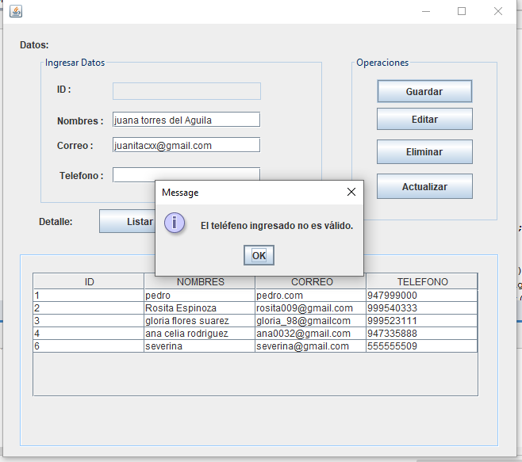

# proy-escritorio
Proyecto CRUD escritorio con java , usando apache NetBeans.
En este proyecto se uso el lenguaje JAVA ,  MVC y la conexión local a la BD MySQL.

-Validaciones con las entradas: nombres,correo,teléfono

-CRUD Con la bd

